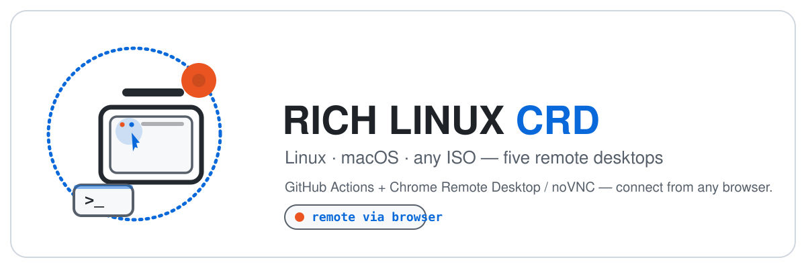

# RICH Linux CRD — Ringkasan Bahasa Indonesia

[English](README.md) | **Bahasa Indonesia**

> Ubuntu 24.04/26.04 di GitHub Actions + Chrome Remote Desktop. Pilih desktop **Cinnamon** yang ringan, **GNOME** yang stabil, atau **XFCE (Beta)** paling cepat — lalu remote dari mana saja dengan PIN. Plus desktop **macOS 15** yang di-stream ke browser via noVNC + Cloudflare Quick Tunnel, dan **Universal VM Runner** untuk boot ISO Linux apa pun di QEMU dengan akses browser.

<p align="center">
  
</p>

Dokumen utama (lengkap, dalam Bahasa Inggris): [README.md](README.md). Halaman ini ringkasannya dalam Bahasa Indonesia.

**Fitur cepat:**
- **Setup 4 langkah, 5 menit** — fork repo → salin perintah CRD → jalankan workflow → konek dari browser. Tanpa SSH, tanpa port forwarding, tanpa firewall.
- **Tema Catppuccin + Ikon Zafiro** — workflow Cinnamon & XFCE otomatis memasang tema Catppuccin-B-LB-Dark dan ikon Zafiro-Nord-Black (Cinnamon via dconf, XFCE via xfconf).
- **Resolusi otomatis 1600x1200** (semua tiga desktop) — xrandr auto-detect tampilan dan menerapkan resolusi optimal, plus fallback autostart.
- **Virtualisasi KVM** — dukungan `/dev/kvm` (Intel VT-x) dimanfaatkan: QEMU/KVM + libvirt + virt-manager + GNOME Boxes siap pakai; user `runner` sudah masuk grup `kvm` dan `libvirt`.
- **Audio streaming** — Chrome Remote Desktop menyiarkan audio dari sesi remote ke browser secara otomatis.
- **Instalasi senyap** — hook needrestart dinonaktifkan, jadi tidak ada log `Scanning processes...` dan tidak ada restart layanan otomatis saat install/upgrade (mencegah sesi CRD putus).
- **Tanpa snap** — `snapd` + deb transisi `thunderbird`/`firefox` di-purge dan di-hold, sehingga tidak ada hang "retry 30 menit ke snap store" saat install desktop. Tradeoff: `snap install` dan katalog Snap di GNOME Software tidak tersedia.
- **XFCE Beta** — desktop ketiga, paling ringan & cepat (`xfce.yml`), memakai runner image **`ubuntu-26.04` public preview**. Label "beta" memang sengaja: image masih preview. KVM di image ini belum terverifikasi → warn-only.
- **macOS 15** — desktop macOS asli (Apple Silicon arm64) via Screen Sharing bawaan + noVNC di browser + Cloudflare Quick Tunnel. Tanpa akun, tanpa API key, tanpa secret sama sekali.
- **Universal VM Runner** — boot ISO Linux apa pun di dalam QEMU (di runner macOS), tampilan VM di-stream ke browser via noVNC. Setelah install selesai & reboot, VM otomatis boot dari disk (bukan installer lagi).


---

## Fitur Unggulan

### Setup Mudah — 4 Langkah, 5 Menit

Tanpa SSH keys, tanpa port forwarding, tanpa firewall. Fork repo ini, salin perintah CRD dari halaman Google, tempel ke workflow GitHub Actions di fork Anda, dan konek dari browser. Seluruh stack — desktop environment, browser, code editor, dan remote access — terinstal otomatis.

### Pengalaman Remote yang Mulus

Sesi semua tiga desktop dikonfigurasi untuk operasi headless:

- **Direct exec** — session file melewati wrapper LightDM/Xsession yang menyebabkan crash "Oh no! Something has gone wrong"
- **Mesa software rendering** (`LIBGL_ALWAYS_SOFTWARE=1`) memastikan desktop render dengan benar di GitHub Actions runner tanpa GPU fisik
- **Screensaver dan lock dinonaktifkan** — sesi tetap hidup dan responsif, tidak pernah timeout atau mengunci Anda keluar
- **Resolusi otomatis 1600x1200** (semua tiga desktop) — xrandr auto-detect tampilan dan menerapkan resolusi optimal, plus fallback autostart

### Audio Streaming

Chrome Remote Desktop menyiarkan audio dari sesi remote ke browser secara otomatis. Tidak perlu konfigurasi PulseAudio atau PipeWire — ketiga desktop memakai audio stack Ubuntu default (XFCE memasang `pulseaudio` secara eksplisit), dan CRD menangani sisanya. Putar musik, tonton video, atau ikut video call — audio langsung jalan.

### Tema Catppuccin & Ikon Zafiro (Cinnamon & XFCE)

Workflow Cinnamon & XFCE hadir dengan tampilan premium langsung dari awal:

- **Catppuccin-B-LB-Dark** — tema GTK/Cinnamon gelap dengan elemen UI yang halus dan rounded
- **Zafiro-Nord-Black** — tema ikon flat minimalis berdasarkan palet warna Nord
- **Wallpaper Catppuccin Black Unicat** — sudah di-set sebagai background desktop
- Tema dan ikon diterapkan otomatis (Cinnamon via dconf, XFCE via xfconf), dengan autostart fallback agar persist lintas sesi

### Dev Tools Bawaan

| Tool | Kegunaan | Tersedia di |
|---|---|---|
| Google Chrome | Browser lengkap dengan ekstensi, profil, dan DevTools | Cinnamon, GNOME & XFCE |
| VS Code | Code editor dengan terminal, ekstensi, dan remote development | **GNOME saja**; untuk Cinnamon atau XFCE pasang via `sudo apt-get install code` |
| OpenCode CLI + Desktop | Asisten coding bertenaga AI | Cinnamon, GNOME & XFCE |
| Virtual Machine tools | QEMU/KVM, libvirt (`virsh`, `virt-install`), virt-manager, GNOME Boxes | Cinnamon, GNOME & XFCE |

GNOME menyediakan shortcut desktop (Antigravity, VS Code, OpenCode, Safe Upgrade). Cinnamon & XFCE menggunakan desktop bersih dengan tool di menu aplikasi.

### Virtualisasi KVM (Hardware-Accelerated VM)

Runner GitHub ini mengekspos `/dev/kvm` (Intel VT-x), jadi desktop bisa menjalankan **VM berakselerasi hardware** — bukan emulasi software yang lambat. Kedua workflow memasang stack QEMU/libvirt dan memberi akses langsung ke user `runner`:

- **QEMU/KVM** (`qemu-system-x86_64`, `/dev/kvm`) — virtualisasi CPU berakselerasi hardware
- **libvirt** (`libvirtd`, `virsh`, `virt-install`) — daemon manajemen VM, aktif saat build
- **Virtual Machine Manager** (`virt-manager`) — GUI lengkap untuk membuat/mengelola VM
- **GNOME Boxes** (`gnome-boxes`) — GUI sederhana untuk pemula

Kelebihan:

- Jalankan ISO apa pun (distro Linux lain, BSD, ISO Windows evaluasi) di dalam desktop remote dengan kecepatan CPU mendekati native
- Nested virtualization aktif — berguna untuk mengetes software yang butuh VT-x (VM di dalam VM bisa jalan)
- Tanpa setup — `runner` sudah masuk grup `kvm` + `libvirt`; tinggal buka **Virtual Machine Manager** atau **GNOME Boxes** → New VM → pilih ISO

Keterbatasan yang jujur:

- KVM **tidak** mempercepat rendering sesi CRD itu sendiri — desktop tetap memakai Mesa software rendering (tanpa GPU fisik). Jangan berharap UI desktop lebih cepat atau GPU acceleration dari fitur ini.
- Tidak ada GPU passthrough. VM sebaiknya memakai display software/virtio (mis. `virtio-gpu` / QXL); akselerasi 3D di dalam guest terbatas.
- Budget vCPU/RAM runner terbatas dan dipakai bersama sesi CRD yang sedang hidup — buat VM dengan ukuran wajar.
- `/dev/kvm` ada di runner tempat proyek ini dikembangkan, tetapi **tidak semua runner GitHub dijamin punya**. Kalau tidak ada, workflow hanya memberi peringatan (tidak gagal) dan VM akan jatuh ke emulasi QEMU TCG yang lambat.

### XFCE (Beta) — Desktop Paling Cepat

Untuk yang menginginkan responsivitas maksimal, coba workflow XFCE baru. Workflow ini memakai runner image **`ubuntu-26.04` public-preview** dan memasang XFCE + xfwm4 minimal (`xfce4`, `xfce4-session`, `xfwm4`, `xfce4-terminal`, `thunar`) — tanpa beban ekstra seperti obs-studio atau duplikat file manager. Sisanya sama dengan keluarga lainnya: sesi CRD direct-exec, auto-resolusi 1600x1200, safe-upgrade, tanpa snap, dan stack KVM (warn-only bila `/dev/kvm` tidak ada).

Batasan beta yang jujur:
- Image `ubuntu-26.04` adalah **public preview** GitHub (diluncurkan Juni 2026) — versi tool bisa beda dari 24.04, ada kemungkinan tidak stabil, plus potensi antrean.
- `/dev/kvm` **belum terverifikasi** di image 26.04; workflow hanya memberi peringatan jika tidak ada.
- Theming memakai `xfconf` (settings daemon XFCE), bukan dconf/gsettings.
- Nama perangkat CRD tampil sebagai **"xfce"** di halaman access.

### macOS — Screen Sharing Bawaan via Browser

Untuk yang menginginkan desktop **macOS asli** (Apple Silicon arm64) yang bisa diakses langsung dari browser modern apa pun — tanpa SSH, tanpa klien VNC, tanpa akun Google, tanpa akun Cloudflare, tanpa secret sama sekali.

Workflow macOS (`macos.yml`) memakai tiga teknologi yang bekerja bersama:

1. **Screen Sharing (server VNC bawaan macOS)** — port 5900, dilindungi password
2. **noVNC** — klien VNC berbasis HTML5 di browser; disajikan lokal di port 6080
3. **Cloudflare Quick Tunnel** — tunnel gratis yang membuat URL acak `*.trycloudflare.com` (tanpa akun atau API key)

Setelah workflow selesai, log mencetak URL. Buka di browser, masukkan VNC password, dan Anda melihat desktop macOS Aqua. Beta ini sengaja **tanpa tool tambahan** — tujuannya membuktikan GUI normal dulu. Runner image sudah punya Homebrew, jadi Anda bisa `brew install` apa pun dari Terminal dalam sesi (mis. `brew install --cask google-chrome`).

Kelebihan:
- **Nol secret**: tidak ada PIN CRD, tidak ada token ngrok, tidak ada akun Cloudflare/Google — cukup password yang Anda set saat menjalankan workflow
- **Bisa dari mana saja** dengan browser (browser mobile juga didukung)
- **Desktop Aqua penuh**: WindowServer, menu aplikasi, dock, Finder — GUI macOS sungguhan
- **Apple Silicon**: macOS 15 berjalan di runner arm64 GitHub-hosted (3 vCPU / 7 GB RAM)
- **Sleep dimatikan**: `pmset` + `caffeinate` menjaga sesi tetap hidup

Batasan jujur:
- Runner macOS memakai **10× lebih banyak Actions credits** per menit dibanding runner Linux (gratis di repo publik, berbayar di repo privat)
- `/dev/kvm` **tidak ada** di macOS — virtualisasi QEMU/KVM tidak bisa jalan. VM macOS tetap bisa lewat UTM / Apple Virtualization.framework (fitur terpisah)
- Izin Screen Recording (TCC) **tidak dibutuhkan** untuk Screen Sharing — `screensharingd` menangkap layar secara native, melewati TCC
- URL Quick Tunnel **ephemeral** — saat workflow berhenti, URL ikut mati (siklus hidup sama seperti sesi CRD)
- Masa hidup runner maksimal **6 jam** (timeout job Actions); untuk sesi lebih lama, jalankan ulang workflow
- **Belum ada helper safe-upgrade** untuk macOS — gunakan `brew upgrade` manual di terminal (beda dengan `apt upgrade` di Linux, `brew upgrade` tidak me-restart stack display di tengah sesi)

### Universal VM Runner — Boot ISO Linux Apa Pun di QEMU

Mau menguji distro, menjalankan workload server, atau menginstal OS sendiri — tanpa menyentuh sesi host? **Universal VM Runner** (`vm-runner.yml`) mem-boot **ISO Linux live/install apa pun** di dalam QEMU pada runner macOS, lalu menampilkan layar VM langsung ke browser via noVNC + Cloudflare Quick Tunnel.

Anda cukup menempelkan **URL ISO** di input workflow. Tidak ada secret, tidak ada akun, tidak ada konfigurasi Cloudflare.

Berjalan di **`macos-15-intel`** (4 vCPU / **14 GB RAM**, gratis di repo publik) — runner macOS gratis dengan spesifikasi tertinggi. Arsitektur terdeteksi otomatis: ISO x86_64/amd64 disarankan (populer, teruji); script mendeteksi **HVF** (`sysctl kern.hv_support`) dan memakai akselerasi hardware kalau tersedia, fallback ke TCG.

Cara kerjanya:

1. **`iso_url`** — tempel tautan langsung ke `.iso` apa pun (x86_64/amd64 disarankan; lihat batasan)
2. QEMU mem-boot ISO sebagai CD-ROM, display VNC di port 5900
3. noVNC + Cloudflare Quick Tunnel mengalirkan VM ke browser
4. Instal OS, lalu **reboot** dari dalam VM
5. `-boot d` + `-no-reboot` membuat QEMU **otomatis beralih ke disk** — setelah installer reboot, VM boot ke OS terpasang, bukan installer lagi
6. Workflow tetap hidup dari proses install → reboot → OS terpasang

**Input** (workflow_dispatch):

| Input | Wajib | Default | Deskripsi |
|---|---|---|---|
| `iso_url` | ya | — | URL langsung ke ISO installer/Live |
| `vm_memory` | tidak | `8G` | RAM VM (runner Intel punya 14 GB) |
| `vm_cpus` | tidak | `4` | vCPU VM (maks 4 di runner Intel) |
| `disk_size` | tidak | `20G` | Ukuran disk virtual (qcow2 sparse) |
| `keep_alive_minutes` | tidak | `360` | Lama sesi (maks 360) |

Kelebihan:
- **Universal**: ISO bootable apa pun — Ubuntu Server, Debian netinstall, Alpine, Fedora, Arch, dsb.
- **Tetap hidup setelah reboot**: installer reboot ke OS terpasang secara otomatis; workflow tidak pernah mati
- **Berbasis browser**: noVNC + Cloudflare Quick Tunnel yang sama seperti workflow macOS
- **Port-forwarding SSH guest** bawaan: `ssh user@127.0.0.1 -p 8022` (host:8022 → guest:22; port 22 host dipakai SSHD runner)
- **Akselerator otomatis**: memakai **HVF** jika runner mengeksposnya, selain itu TCG same-arch — dan memperingatkan keras untuk kombinasi lintas-arsitektur (lambat)

Batasan jujur:
- **Ketersediaan HVF/KVM bervariasi**: runner macOS GitHub-hosted umumnya tanpa nested virtualization (arm64 dipastikan tidak ada; Intel mungkin mengekspos `kern.hv_support=1`). Script mendeteksinya saat runtime — HVF kalau ada, selain itu **TCG** (software emulation). Menyamakan **arsitektur guest dengan runner** menjaga TCG tetap wajar; kombinasi lintas-arsitektur (mis. ISO ARM64 di runner Intel) sangat lambat.
- **Disk runner 14 GB** — ISO besar >4 GB ditambah qcow2 besar bisa tidak muat. Pilih ISO ramping/netinstall, dan gunakan URL unduhan langsung (bukan halaman browser).
- **Koneksi VNC putus sesaat** saat VM reboot (beberapa detik; noVNC auto-reconnect dengan `reconnect=true&reconnect_delay=3000`).
- **Disk ephemeral** — qcow2 berada di runner dan hilang saat workflow berakhir. Belum ada persistensi.
- **ISO tamu macOS belum didukung** di versi pertama ini (tamu macOS butuh konfigurasi bootloader OpenCore).

### Upgrade Anti-Putus

Menjalankan `sudo apt upgrade` di dalam sesi CRD memutus koneksi (karena me-restart service CRD/GNOME/systemd). Helper [`safe-upgrade`](scripts/safe-upgrade.sh) menyelesaikan ini:

- Menahan paket kritis (CRD, desktop shell, systemd, kernel)
- Mengupgrade sisanya dengan aman
- MOTD warning di ketiga workflow (plus shortcut **Safe Upgrade** di GNOME) mencegah `apt upgrade` yang tidak sengaja

`safe-upgrade` juga dilengkapi fitur keamanan ekstra:

- **Version diff** — menampilkan setiap paket yang di-upgrade sebagai `nama: versi_lama → versi_baru`, plus paket baru dan yang dihapus
- **`--cleanup`** — menjalankan `apt-get autoremove` setelah upgrade untuk menghemat ruang disk
- **Rollback tracking** — snapshot semua versi paket sebelum & sesudah ke `/var/log/safe-upgrade-pre.log` dan `/var/log/safe-upgrade-post.log`
- **Tabel ringkasan** — ringkasan berwarna untuk paket yang di-upgrade / di-hold / dihapus dan durasi
- **Cek reboot kernel** — memperingatkan bila kernel baru terinstall tetapi belum aktif
- **Anti-interupsi** — trap `SIGINT`/`SIGTERM`/`EXIT` otomatis melepas hold paket bila upgrade dibatalkan di tengah jalan

---

## Mulai Cepat (5 menit)

Workflow memakai `workflow_dispatch`, jadi **harus dijalankan dari fork milik Anda** — GitHub hanya mengizinkan trigger Actions di repo yang Anda kontrol.

### 0. Fork repository ini

1. Buka <https://github.com/kiraadityaa/rich-linux-crd>.
2. Klik **Fork** (kanan atas) untuk membuat salinan di akun GitHub Anda.
3. Semua langkah berikut dilakukan di **fork Anda**.

### 1. Ambil perintah host CRD

1. Buka <https://remotedesktop.google.com/headless> di browser yang login akun Google.
2. Klik **Begin** → **Next** → **Authorize**.
3. Salin **perintah Debian Linux** yang muncul (diawali `DISPLAY= ... start-host ...`). Jangan dijalankan di lokal — cukup salin.

### 2. Jalankan workflow

1. Buka tab **Actions** di **fork Anda**.
2. Pilih workflow:
   - **RICH LINUX (Cinnamon + Chrome Remote Desktop)** → file `.github/workflows/cinnamon.yml`
   - **RICH LINUX (GNOME + Chrome Remote Desktop)** → file `.github/workflows/gnome.yml`
   - **RICH LINUX (XFCE Beta + Chrome Remote Desktop)** → file `.github/workflows/xfce.yml` (public-preview `ubuntu-26.04`, **beta**)
   - **RICH LINUX (macOS + noVNC + Cloudflare Quick Tunnel)** → file `.github/workflows/macos.yml` (lihat bagian [macOS](#macos--screen-sharing-bawaan-via-browser))
   - **Universal VM Runner (QEMU + noVNC + Cloudflare)** → file `.github/workflows/vm-runner.yml` (lihat bagian [Universal VM Runner](#universal-vm-runner--boot-iso-linux-apa-pun-di-qemu))
3. Klik **Run workflow**, tempel perintah CRD ke field `crd_host_command`, klik **Run** (untuk workflow macOS isi field `vnc_password`; untuk VM Runner isi field `iso_url`).
4. Tunggu sekitar 5–10 menit sampai log menampilkan `CHROME REMOTE DESKTOP READY` (atau `MACOS REMOTE DESKTOP READY` untuk macOS).

### 3. Connect

1. Buka <https://remotedesktop.google.com/access>.
2. Klik perangkatmu → masukkan PIN:
   - Default: `123456`
   - Custom: buat secret repo bernama `CRD_PIN` (minimal 6 digit) sebelum menjalankan workflow.

---

## Cinnamon vs GNOME

|  | Cinnamon (`cinnamon.yml`) | GNOME (`gnome.yml`) |
|---|---|---|
| Tampilan | Klasik ala Linux Mint | Modern ala Ubuntu |
| Ukuran install | Sekitar 1 GB | Sekitar 2 GB |
| Tema | Catppuccin-B-LB-Dark + ikon Zafiro-Nord-Black (otomatis) | Adwaita default |
| Resolusi | Otomatis 1600x1200 via xrandr (retry + fallback autostart) | Otomatis 1600x1200 via xrandr (retry + fallback autostart) |
| Sesi CRD | `exec /usr/bin/cinnamon-session --session cinnamon` + `LIBGL_ALWAYS_SOFTWARE=1` | `exec /usr/bin/gnome-session --session=ubuntu` (auto-detect `ubuntu` > `gnome` > `gnome-xorg`) + `LIBGL_ALWAYS_SOFTWARE=1` |
| Display manager | Tidak dipakai (headless) | Tidak dipakai (headless) |
| Shortcut desktop | Tidak ada (desktop bersih) | Antigravity, VS Code, OpenCode, Safe Upgrade |
| Dev tools | Chrome + OpenCode CLI/Desktop | Chrome + VS Code + OpenCode CLI/Desktop |
| Virtualisasi | QEMU/KVM + libvirt + virt-manager + GNOME Boxes | QEMU/KVM + libvirt + virt-manager + GNOME Boxes |
| Screensaver, lock, suspend | Dinonaktifkan | Dinonaktifkan |
| Wallpaper | Catppuccin Black Unicat (via `org.cinnamon.desktop.background`) | Catppuccin Black Unicat (via `org.gnome.desktop.background`) |
| Upgrade | `safe-upgrade` di sesi (tanpa build-time full upgrade — bisa ditambah via kustomisasi) | Full upgrade di build-time + `safe-upgrade` di sesi |
| Cocok untuk | Tampilan ala Mint, ukuran lebih ringan, tema premium | Stabilitas maksimal |

> [!NOTE]
> **XFCE (Beta)** (`xfce.yml`) adalah pilihan desktop ketiga — paling cepat & responsif, memakai image public-preview `ubuntu-26.04`. Detail & batasan jujurnya ada di bagian fitur di atas.

---

## Troubleshooting: Error "Oh no! Something has gone wrong"

Gejala: PIN benar dan koneksi berhasil, tapi layar menampilkan wajah sedih dengan tombol **Log Out**.

Penyebab: session file lama memakai wrapper `lightdm-session` yang membutuhkan LightDM seat fisik — tidak ada di runner CRD yang headless.

Solusi sudah diterapkan di ketiga workflow (direct exec tanpa wrapper, plus paket Mesa/LLVMPipe untuk software rendering):

```bash
# Cinnamon
DESKTOP_SESSION=cinnamon
XDG_CURRENT_DESKTOP=X-Cinnamon
XDG_SESSION_TYPE=x11
XDG_RUNTIME_DIR=/run/user/$(id -u)
LIBGL_ALWAYS_SOFTWARE=1
exec /usr/bin/cinnamon-session --session cinnamon

# GNOME (auto-detect ubuntu > gnome > gnome-xorg)
DESKTOP_SESSION=ubuntu
XDG_CURRENT_DESKTOP=ubuntu:GNOME
XDG_SESSION_TYPE=x11
XDG_RUNTIME_DIR=/run/user/$(id -u)
LIBGL_ALWAYS_SOFTWARE=1
MUTTER_DEBUG_FORCE_SOFTWARE_RENDER=1
exec /usr/bin/gnome-session --session=ubuntu

# XFCE (Beta)
DESKTOP_SESSION=xfce
XDG_CURRENT_DESKTOP=XFCE
XDG_SESSION_TYPE=x11
XDG_RUNTIME_DIR=/run/user/$(id -u)
LIBGL_ALWAYS_SOFTWARE=1
exec /usr/bin/xfce4-session
```

---

## Penting: jangan `apt upgrade` polos di dalam sesi

Gejala: setelah `sudo apt update && sudo apt upgrade -y`, sesi tiba-tiba putus dan tidak bisa konek ulang.

Penyebab: upgrade ikut menaikkan `chrome-remote-desktop` / `gnome-shell` / `mutter` / `gdm3` / `systemd` / `dbus`, lalu service-nya di-restart sehingga sesi X mati.

> [!WARNING]
> Jangan jalankan `sudo apt upgrade -y` polos di dalam sesi CRD. Pakai helper `safe-upgrade`.

| Kebutuhan | Cara |
|---|---|
| Upgrade harian yang aman (di terminal CRD) | `safe-upgrade` |
| Cek dulu tanpa mengubah apa pun | `safe-upgrade --check` |
| Upgrade + autoremove (hemat disk) | `safe-upgrade --cleanup` |
| Upgrade CRD/Chrome/desktop juga (SESI AKAN PUTUS) | `safe-upgrade --allow-crd-restart` / `safe-upgrade --include-desktop` |
| Dapat upgrade kritis tanpa putus | Re-run workflow Actions (workflow GNOME menjalankan full `upgrade` di build-time) |
| Lihat paket yang berubah | Baca version diff di output `safe-upgrade`, atau diff `/var/log/safe-upgrade-pre.log` vs `/var/log/safe-upgrade-post.log` |

Implementasi: [`scripts/safe-upgrade.sh`](scripts/safe-upgrade.sh). Dilengkapi **tabel ringkasan** berwarna, **version diff** (lama → baru), **rollback log** (`/var/log/safe-upgrade-pre.log` & `post.log`), **cek reboot kernel**, dan **trap anti-interupsi** yang otomatis melepas hold paket. Workflow GNOME juga memasang shortcut desktop **Safe Upgrade**; ketiga workflow memasang MOTD warning.

### virt-manager: "Failed to connect socket to '/var/run/libvirt/libvirt-sock': Permission denied"

Gejala: di dalam sesi CRD, `virt-manager` (atau `virsh`) tidak bisa connect ke `qemu:///system`, dan `test -r /dev/kvm` gagal.

Penyebab: ini **bukan** masalah polkit — melainkan keanggotaan grup. Daemon CRD me-spawn proses sesi dengan supplementary groups yang dimilikinya **saat daemon start**. Jika daemon sudah berjalan lebih dulu sebelum `usermod -aG kvm,libvirt runner` (mis. runner yang hidup terus lintas re-run workflow), proses turunannya tidak pernah menerima grup `kvm` / `libvirt`, sehingga tidak bisa membuka socket `srw-rw---- root:libvirt` maupun `/dev/kvm` (`crw-rw---- root kvm`).

Perbaikan (sudah diterapkan di ketiga workflow): step pemberi grup kini **me-restart daemon CRD** agar systemd meng-inisialisasi ulang supplementary groups dari `/etc/group`:

```bash
sudo usermod -aG kvm runner || true
sudo usermod -aG libvirt runner || true
sudo systemctl restart chrome-remote-desktop@runner || true   # opsional bila daemon belum jalan
```

Cek mandiri di dalam terminal CRD (`id -nG` harus memuat `kvm` dan `libvirt`):

```bash
id -nG
virsh -c qemu:///system list --all
```

> [!NOTE]
> Untuk sesi **live**, perintah yang sama berlaku juga — tetapi koneksi Anda putus sekali (konek ulang dengan PIN). Proses baru (terminal baru, aplikasi yang baru dibuka) mendapatkan grup setelah restart; terminal yang sudah terbuka sebelumnya tidak.

---

## Struktur repo

```
rich-linux-crd/
├── .github/workflows/       # cinnamon.yml, gnome.yml, xfce.yml (XFCE = beta), macos.yml, vm-runner.yml
├── assets/
│   ├── architecture.svg     # Diagram arsitektur di README
│   ├── cinnamon-theme.zip   # Tema Catppuccin + ikon Zafiro (otomatis diinstal oleh workflow Cinnamon & XFCE)
│   ├── rich-linux-crd-banner.svg
│   └── rich-linux-crd-logo.svg
├── opencode-setup/          # opencode-skills.md (panduan skill agent OpenCode + Context7)
├── scripts/                 # safe-upgrade.sh (version diff, --cleanup, rollback log, summary, reboot check)
│   ├── mac/
│   │   └── setup-remote-access.sh  # macOS: Screen Sharing + noVNC + Cloudflare Quick Tunnel
│   └── qemu/
│       └── setup-vm.sh             # Universal VM: download ISO, qcow2 disk, boot loop QEMU, noVNC, tunnel
├── README.md                # Dokumen utama (Inggris)
├── README.id.md             # File ini (Indonesia)
├── AGENTS.md                # Panduan melanjutkan proyek untuk agent/dev (Bahasa Indonesia)
├── LICENSE
└── .gitignore
```

---

## Kustomisasi

| Kebutuhan | Cara |
|---|---|
| Ganti PIN | Buat secret repo `CRD_PIN` (Settings → Secrets → Actions), minimal 6 digit |
| Ganti password user `runner` | Edit baris `echo "runner:...` di workflow. Default password "root" di ketiga workflow |
| Tambah aplikasi | Tambah step `apt-get install` baru sebelum step CRD, mis. `apt-get install -y code` untuk menambah VS Code di Cinnamon (needrestart sudah dinonaktifkan, jadi tetap senyap) |
| Ganti wallpaper | Edit URL download di step **Set Wallpaper** di workflow |
| Ganti resolusi tampilan | Edit config dummy Xorg dan perintah xrandr di step **Configure CRD Cinnamon Session** (STEP 08) di `cinnamon.yml` |
| Kelola virtual machine | Buka **Virtual Machine Manager** atau **GNOME Boxes** dari menu aplikasi → New VM → pilih ISO (`runner` sudah punya akses `/dev/kvm`) |
| Ganti tema | Ganti `cinnamon-theme.zip` di `assets/` dengan tema Anda sendiri (harus berisi direktori `themes/` dan `icons/`) |
| Perpanjang durasi | Edit `sleep 21600` di step **Keep Alive** (maks 6 jam karena limit Actions) |

---

## Catatan

- Workflow menggunakan `workflow_dispatch` — hanya berjalan saat Anda menjalankan secara manual.
- GitHub hanya mengizinkan Actions di repo yang Anda kontrol — **fork repository ini dulu**, lalu jalankan workflow dari fork Anda.
- Jangan commit perintah CRD ke repo (berisi kode auth sekali pakai). Cukup tempel ke input workflow.
- PIN default `123456` hanya untuk kemudahan. Untuk penggunaan serius, buat `CRD_PIN` custom.
- GitHub Actions free tier punya batas menit bulanan — pantau Settings → Billing.
- Workflow Cinnamon secara otomatis memasang tema Catppuccin dan ikon Zafiro dari `assets/cinnamon-theme.zip` — tidak perlu setup manual.
- Resolusi tampilan di-set ke 1600x1200 via xrandr auto-detection di session file (semua tiga desktop).
- KVM tersedia di runner GitHub ini (`/dev/kvm`, Intel VT-x, nested = aktif) — dipakai untuk **VM berakselerasi hardware** di dalam desktop. Fitur ini tidak mempercepat rendering CRD itu sendiri, dan ketersediaannya bisa berbeda antar fleet runner GitHub: kalau `/dev/kvm` tidak ada, workflow hanya memperingatkan (tidak gagal) dan VM akan jatuh ke QEMU TCG (lambat).
- Snap sengaja **dihapus permanen (purge + hold)** di ketiga workflow. Alasannya: `thunderbird` di Ubuntu 24.04 adalah *deb transisi* yang post-install-nya memaksa `snap install thunderbird` — di runner tanpa akses store yang baik, ini retry 30 menit dan menahan seluruh install desktop. `snapd`, `thunderbird` (snap-transitional), dan `firefox` di-purge setelah install dan di-hold agar tidak bisa ter-reinstall diam-diam. Tradeoff yang jujur: `snap install` tidak tersedia, Snap Store tidak muncul lagi di GNOME Software (source apt tetap ada), dan `firefox` dicopot — Google Chrome tetap sebagai browser. Kalau butuh browser lain, install Firefox ESR atau Chromium via apt.
- Workflow **XFCE Beta** (`xfce.yml`) memakai runner image `ubuntu-26.04` yang masih **public preview** (diumumkan Juni 2026). Belum seterbukti workflow 24.04; laporkan masalah ke issue tracker dengan nama workflow `xfce.yml`.
- `safe-upgrade` menyimpan snapshot versi paket sebelum/sesudah di `/var/log/safe-upgrade-pre.log` dan `/var/log/safe-upgrade-post.log` — diff keduanya untuk melihat perubahan persis.
- Proyek ini **hanya untuk penggunaan yang sah**. Lihat [Kebijakan Penggunaan & Disclaimer](#kebijakan-penggunaan--disclaimer).

---

## Kebijakan Penggunaan & Disclaimer

**Proyek ini ditujukan semata-mata untuk penggunaan yang sah dan wajar** — belajar, pengembangan, menguji sistem yang Anda miliki atau diberi izin, serta kerja remote desktop umum. Desktop yang dikirim adalah lingkungan tujuan umum yang netral (browser, terminal, editor, tool virtualisasi); dipakai untuk hal yang sah atau ilegal sepenuhnya adalah tanggung jawab orang yang menjalankannya.

### Tidak diperbolehkan (contoh konkret)

Menggunakan proyek ini untuk hal-hal berikut dilarang:

1. **Akses tanpa izin** — hacking, intrusion, cracking, pencurian kredensial/sesi terhadap sistem, akun, atau jaringan yang bukan milik Anda atau yang tidak berwenang Anda akses.
2. **Serangan siber** — meluncurkan serangan DDoS, menjalankan botnet, spam flooding, atau kampanye phishing.
3. **Malware** — membuat, menyebarkan, atau menghosting virus, ransomware, spyware, keylogger, atau perangkat lunak berbahaya lainnya.
4. **Pencurian data & penipuan** — mencuri, menjual, atau memperdagangkan data/akun curian; penipuan identitas atau pembayaran; pemerasan.
5. **Konten ilegal** — memiliki atau menyebarkan konten ilegal, termasuk materi pelecehan seksual anak (CSAM).
6. **Penyalahgunaan resource** — mining mata uang kripto pada resource yang bukan milik Anda atau tanpa izin (termasuk menit Actions runner yang menjalankan workflow ini).
7. **Pelanggaran terms of service** — apa pun yang melanggar GitHub Terms of Service, ketentuan Google Chrome Remote Desktop, lisensi Ubuntu/Microsoft, atau hukum lokal/nasional di wilayah hukum Anda.

### Konsekuensi

- **GitHub:** akun, repo, atau penggunaan Actions Anda bisa di-suspend/dihentikan karena pelanggaran ToS; menit bisa dicabut tanpa pengembalian.
- **Google:** akun Google dan akses Chrome Remote Desktop Anda bisa dinonaktifkan.
- **Hukum:** penyedia berhak melaporkan penyalahgunaan ke penegak hukum; Anda dapat menghadapi tuntutan pidana atau perdata sesuai hukum wilayah Anda — sepenuhnya menjadi tanggung jawab Anda.

### Model fork = tanggung jawab Anda

Saat Anda fork repo ini, workflow berjalan di bawah akun **Anda**, memakai menit Actions **Anda**, dan terdaftar ke akun Google **Anda**. Pengembang:

- **tidak memiliki kontrol, visibilitas, atau keterlibatan** apa pun atas fork atau sesi pengguna;
- tidak memantau, mencatat, atau mengakses sesi pengguna;
- tidak dapat membantu, mendukung, atau memverifikasi penggunaan instance seseorang.

Proyek ini disediakan **"AS-IS", tanpa jaminan apa pun**, di bawah Lisensi MIT. Pengembang **tidak bertanggung jawab** atas penyalahgunaan, kerugian, pelanggaran ToS, atau konsekuensi hukum apa pun yang timbul dari penggunaan atau fork proyek ini oleh siapa pun.

Gunakan dengan bijak: bangun, pelajari, dan uji — tetapi hanya pada sistem dan resource yang berhak Anda gunakan.

---

## Lisensi

MIT — lihat [LICENSE](LICENSE).
